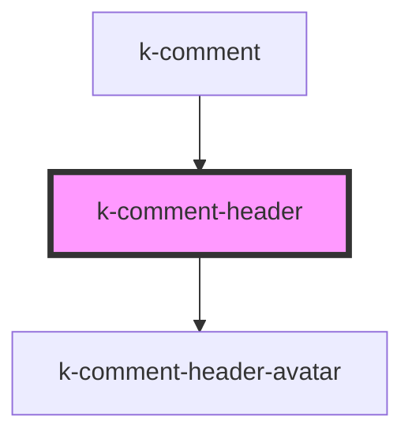

# k-comment-header

<!-- Auto Generated Below -->

## Dependencies

### Used by

 - [k-comment](../comment)

### Depends on

- [k-comment-header-avatar](../comment-header-avatar)

### Graph

----------------------------------------------

*Built with [StencilJS](https://stenciljs.com/)*
